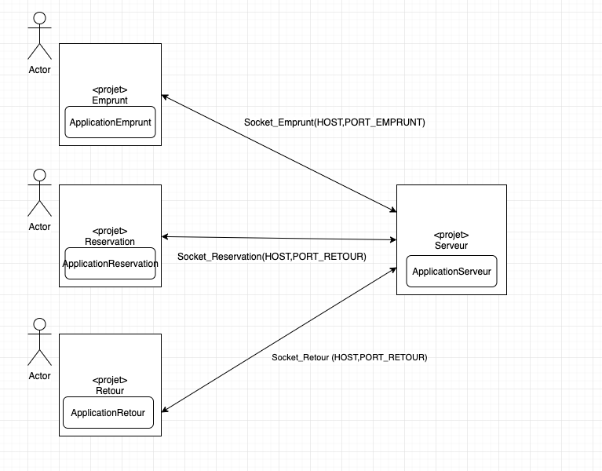
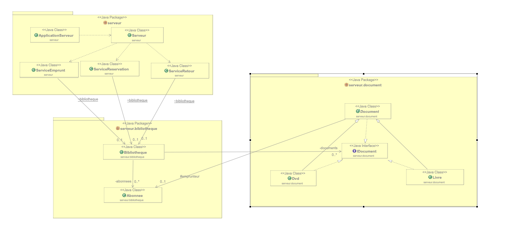
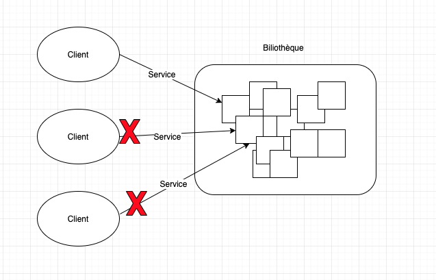

# Projet_AppServeur

## Résumé du projet :

Une librairie souhaite developper une application pour permètre à ses utilisateurs de pourvoir '**réserver**' un document en ligne. Une fois réservé le document n'est qu'uniquement empruntable sur place à l'utilisateur qui l'a reservé, on peut cependant toujours **'emprunter'** un document sur place sans avoir à le reserver. L'application devra aussi gérer les '**retours'** des documents sur place par ceux qui les ont empruntés. 

## Objectif du projet :

Le but du projet sera de créer les trois services de cette application tout en gérant les **problèmes de concurrence** que peuvent engendrer l'execution de plusieurs threads. Il faudra synchroniser les threads notamment en créant une **exclusion mutuelle** des sections critiques pour ne pas que tous les utilisateurs puissent acceder simultanément à la même ressource partagée. 
Il faudra également penser que le code des applications 'emprunt', 'retour', et 'reservation' seront executés à distance. Il faudra donc créer trois serveurs avec trois ports différents en utilisant les méthodes socket pour pouvoir faire communiquer les applications clientes à celle de la bibliothèque. Il serait donc absurde qu'un code client utilise une partie d'un code serveur, ceux-ci ne doivent communiquer uniquement que par les sockets.

## Réalisation du projet :

Pour notre projet il faudra donc avoir quatres projets distinct représant chacun un service pour le client, et l'autre projet sera celui du 'serveur' de la bibliothèque. Ces trois projets devront communiquément entres-eux uniquement par les objets sockets. L'applicationServeur une fois lancé lancera trois 'Serveurs' d'écoutes de chacun des différents services.  On pourra donc communiquer en permanence avec le Serveur à moins qu'il ne soit interrompue. 



Les projets Emprunt, Reservation, et Retour ne contiennent qu'une classe 'main' servant d'executable, et n'ont pas besoin de classe à instancier. Contrairement au serveur qui a des classes serveur, services, bibliotheque, abonnee, document, etc ...

Voici la réprésentation UML du projet **'Serveur'** :



## Présentation des problèmes de concurrence

Nous rencontrons un problème de synchronisation. Nous avons plusieurs clients qui ne sont pour la plupart pas dans le même espace qui souhaite effectuer des opérations sur la bibliothèque. Ils veulent soit emprunter, soit reserver, ou soit retourner certains documents, sauf que des problèmes de concurrence peuvent se créer dès lors que deux clients souhaitent effectuer des opérations sur le même document.



Il faut donc assurer la sûreté des threads **'service'** pour ne pas qu'ils s'entrelacent. Pour pouvoir corriger ce problème il faudra donc créer une exclusion mutuelle des sections critiques.

## Exclusion mutuelle des sections critiques ****

### Identifier la ressource partagée:

La ressource partargée représente l'objet qui va être utilisée par plusieurs threads, en l'occurence ici les documents à l'intérieur de la bibliothèque. Il faudra donc que chaque thread ayant accès à la section critique ne puisse pas modifier celle-ci en même temps.

Voici comment celle-ci est distribué entres threads :

 
```java
    public class ApplicationServeur {
    	...
    
    	public static void main(String[] args) throws Exception {
    		Bibliotheque bibliotheque = new Bibliotheque();
    		
    		bibliotheque.ajouter_document(new Livre(1, "AppServJava"));
    		bibliotheque.ajouter_document(new Livre(2, "AppWebJava"));
    		bibliotheque.ajouter_document(new Livre(3, "AppRefJava"));
    		for (int i = 1; i <= 20; i++) {
    			bibliotheque.ajouter_abonnee(new Abonnee(i,i));;
    		}
    		bibliotheque.ajouter_document(new Dvd(11, "Django Unchained"));
    		bibliotheque.ajouter_document(new Dvd(22, "Inglorious Basterds",16));
    		bibliotheque.ajouter_document(new Dvd(33, "Taxi Driver",12));
    		
    		ServiceEmprunt.setBibliotheque(bibliotheque);
    		ServiceReservation.setBibliotheque(bibliotheque);
    		ServiceRetour.setBibliotheque(bibliotheque);
    		
    		...
    }

    public class ServiceEmprunt implements Runnable{
    	
    	// **** ressources partagees : la bibliotheque *******
    	private static Bibliotheque bibliotheque;
    	
    	public static void setBibliotheque(Bibliotheque bibliotheque) {
    		ServiceEmprunt.bibliotheque = bibliotheque;
    	}
    	
    	// *************************************************************
    	
    	private final Socket client;
    	private static int cpt = 1;
    	private final int numero;
    
    	ServiceEmprunt(Socket socket){
    		this.client = socket;
    		this.numero = cpt ++;
    	}
    	
    	...
    }
```

### Identifier les sections critiques

Une section critique est vue comme une opération atomique (une seule opération indivisible) ne pouvant pas être effectué par deux threads en même temps . 

En l'occurence ici les sections critiques serait les opérations 'Emprunter', 'Reserver', et 'Retour' de l'interface IDocument :

```java
    public interface IDocument {
    	int numero();
    	void reserver(Abonnee ab) throws EmpruntException ;
    	void emprunter(Abonnee ab) throws EmpruntException;
    	void retour() throws RetourException;
    }
```

### Créer l'exclusion mutuelle

 Plusieurs sections critiques dépendantes ne doivent jamais exécuter leur code simultanément (par plusieurs threads différents) : on dit qu'elles sont en exclusion mutuelle. Toutes les classe implémentants IDocument ne peuvent pas avoir deux threads executer la même méthode sur la même instance. 

Pour mettre en place l'exclusion mutuelle, il faut utiliser des verrous. Lorsqu'un thread entre dans une section critique, il demande le verrou. S'il l'obtient, il peut alors exécuter le code. S'il ne l'obtient pas, parce qu'un autre thread l'a déjà pris, il est alors bloqué en attendant de l'obtenir. Pour réaliser ceci en Java, la méthode la plus simple est d'utiliser le mot-clé **synchronized.**

```java
    public abstract class Document implements IDocument{
    	private int numero;
    	private String titre;
    	private boolean isReserve;
    	private boolean isDisponible;
    	private Abonnee emprunteur;
    	
    	public Document(int numero, String titre) {
    		this.setNumero(numero);
    		this.setTitre(titre);
    		this.setReserve(false);
    		this.setDisponible(true);
    		this.setEmprunteur(null);
    	}
    	
    	@Override
    	public int numero() {
    		return this.getNumero();
    	}
    
    	@Override
    	public void reserver(Abonnee ab) throws EmpruntException { //La reservation s'effectue si le livre n'a pas deja ete reserve et est disponible a la bibliotheque
    		synchronized(this) {
    			if(this.isReserve() || !this.isDisponible() || ab.isInterdisEmprunt()) //le livre est deja reserve ou n'est pas disponible
    				throw new EmpruntException(ab,this);
    			Timer timer = new Timer();
    			this.setReserve(true);
    			timer.schedule(new FinReservation(timer,this),30000); //reserve pendant 10 secondes
    			this.setEmprunteur(ab);
    			System.out.println("le document numero : " + this.getNumero() + ", intitule : " + this.getTitre()
    			+ " est reserve pendant 2 heures par " + ab.getId());
    		}
    	}
    
    	@Override
    	public void emprunter(Abonnee ab) throws EmpruntException { //L'emprunt s'effecture si le livre est reserve a l'abonnee et si il est disponible
    		
    		synchronized(this) {
    			if(!this.isDisponible() || ab.isInterdisEmprunt()) //le livre n'est plus disponible ou la personne voulant l'emprunter n'a pas le bonne Id
    				throw new EmpruntException(ab,this);
    			if(this.isReserve() & this.getEmprunteur() != ab)
    				throw new EmpruntException(ab,this);
    			this.setDisponible(false);
    			this.setReserve(true);
    			this.setEmprunteur(ab);
    			System.out.println("le document numero : " + this.getNumero() + ", intitule : " + this.getTitre()
    			+ " a bien ete emprunter par " + ab.getId());
    		}
    		
    	}
    
    	@Override
    	public void retour() throws RetourException { //Le retour s'effectue si le livre n'etait plus disponible
    		
    		synchronized(this) {
    			if(this.isDisponible())
    				throw new RetourException(this);
    			this.setDisponible(true);
    			this.setReserve(false);
    			this.setEmprunteur(null);
    			System.out.println("le document numero : " + this.getNumero() + ", intitule : " + this.getTitre()
    					+ " a bien ete rendue nous vous remercions et vous souhaitons un joyeux noel" );
    		}
    	}
```

## Correction de l'accès à la ressource partagée :

Au début de notre projet nous avions créer une classe 'Bibliotheque' contenant tous nos documents, et qui constituée notre **ressource partagée**. Nous obtenions donc le code suivant lorsque nous voulions donner cette ressource partagée aux trois services 'emprunt', 'retour', et 'reservation' :

```java
    public class ApplicationServeur {
    	private final static int PORT_RESERVATION = 2500;
    	private final static int PORT_EMPRUNT = 2600;
    	private final static int PORT_RETOURS = 2700;
    	
    	public static void main(String[] args) throws Exception {
    		Bibliotheque bibliotheque = new Bibliotheque();
    		
    		bibliotheque.ajouter_document(new Livre(1, "AppServJava"));
    		bibliotheque.ajouter_document(new Livre(2, "AppWebJava"));
    		bibliotheque.ajouter_document(new Livre(3, "AppRefJava"));
    		for (int i = 1; i <= 10; i++) {
    			bibliotheque.ajouter_abonnee(new Abonnee(i));;
    		}
    		
    		
    		try {
    			new Thread(new Serveur(PORT_RESERVATION,bibliotheque)).start();
    			new Thread(new Serveur(PORT_EMPRUNT,bibliotheque)).start();
    			new Thread(new Serveur(PORT_RETOURS,bibliotheque)).start();
    			System.out.println("Serveur lance sur les ports " + PORT_RESERVATION + " , " + PORT_EMPRUNT + " , " + PORT_RETOURS);
    		} catch(IOException e) {
    			System.err.println("Pb lors de la création du serveur : " +  e);
    		}
    	}
    }
	```

Comme nous pouvons le voir le constructeur de la classe 'Serveur' prend la ressource partagée 'Bibliotheque' en parametre, pour après la redistribuée à ses différents 'Service'. Cependant la classe 'Serveur' n'a rien avoir avec la ressource partagée qui devrait seulement être présente dans les 'Service'. 
Il fallait donc plutôt créer un jeu de documents en dur dans la classe 'ApplicationServeur' et  passer la réféféremce de ces documents via un sette static.

## Avant :

```java
    public class ServiceEmprunt implements Runnable{
    	private Bibliotheque bibliotheque;
    	private final Socket client;
    	private static int cpt = 1;
    	private final int numero;
    	
    	
    	
    	ServiceEmprunt(Socket socket, Bibliotheque bibliotheque){
    		this.client = socket;
    		this.bibliotheque = bibliotheque;
    		this.numero = cpt ++;
    	}
```

## Après :

```java
    public class ServiceEmprunt implements Runnable{
    	// **** ressources partagees : la bibliotheque *******
    	static Bibliotheque bibliotheque;
    	public static void setBibliotheque(Bibliotheque bibliotheque) {
    		ServiceEmprunt.bibliotheque = bibliotheque;
    	}
    	// *************************************************************
    	private final Socket client;
    	private static int cpt = 1;
    	private final int numero;
    	ServiceEmprunt(Socket socket){
    		this.client = socket;
    		this.numero = cpt ++;
    	}

    public class ApplicationServeur {
    	private final static int PORT_RESERVATION = 2500;
    	private final static int PORT_EMPRUNT = 2600;
    	private final static int PORT_RETOURS = 2700;
    	
    	public static void main(String[] args) throws Exception {
    		Bibliotheque bibliotheque = new Bibliotheque();
    		
    		bibliotheque.ajouter_document(new Livre(1, "AppServJava"));
    		bibliotheque.ajouter_document(new Livre(2, "AppWebJava"));
    		bibliotheque.ajouter_document(new Livre(3, "AppRefJava"));
    		for (int i = 1; i <= 10; i++) {
    			bibliotheque.ajouter_abonnee(new Abonnee(i));;
    		}
    		
    		ServiceEmprunt.setBibliotheque(bibliotheque);
    		ServiceReservation.setBibliotheque(bibliotheque);
    		ServiceRetour.setBibliotheque(bibliotheque);
    		
    		try {
    			new Thread(new Serveur(PORT_RESERVATION)).start();
    			new Thread(new Serveur(PORT_EMPRUNT)).start();
    			new Thread(new Serveur(PORT_RETOURS)).start();
    			System.out.println("Serveur lance sur les ports " + PORT_RESERVATION + " , " + PORT_EMPRUNT + " , " + PORT_RETOURS);
    		} catch(IOException e) {
    			System.err.println("Pb lors de la création du serveur : " +  e);
    		}
    	}
    }
```


En faisant de cette manière nous brisons les dépendances de la classe 'Serveur' avec la ressource partagée.

## L'utilisation du Switch_Case dans la classe Serveur :

Le problème avec la classe serveur est qu'elle ne sert juste qu'à donner la socket client aux Services et de lancer leur thread. Il serait donc inutile de créer trois classes Serveurs supplémentaires pour chaques services alors que l'on pourrait n'en créer qu'une seule et utiliser un switch-case. C'est ce que nous avons fait :

```java
    public class ApplicationServeur {
    	private final static int PORT_RESERVATION = 2500;
    	private final static int PORT_EMPRUNT = 2600;
    	private final static int PORT_RETOURS = 2700;
    	
    	public static void main(String[] args) throws Exception {
    		 ...
    		try {
    			new Thread(new Serveur(PORT_RESERVATION)).start();
    			new Thread(new Serveur(PORT_EMPRUNT)).start();
    			new Thread(new Serveur(PORT_RETOURS)).start();
    			System.out.println("Serveur lance sur les ports " + PORT_RESERVATION + " , " + PORT_EMPRUNT + " , " + PORT_RETOURS);
    		} catch(IOException e) {
    			System.err.println("Pb lors de la création du serveur : " +  e);
    		}
    	}
    }

    public class Serveur implements Runnable{
    	
    	private ServerSocket aServerSocket;
    	private int portId;
    	
    	
    	Serveur(int port) throws IOException {
    		portId = port;
    		aServerSocket = new ServerSocket(port);
    		
    	}
    
    	@Override
    	public void run() {
    		try {
    			while(true) {
    				switch(this.portId) {
    					case 2500:
    						new Thread(new ServiceEmprunt(aServerSocket.accept())).start();
    						System.out.println("connexion 2500");
    						
    						break;
    					case 2600:
    						new Thread(new ServiceReservation(aServerSocket.accept())).start();
    						System.out.println("connexion 2600");
    						break;
    					case 2700:
    						new Thread(new ServiceRetour(aServerSocket.accept())).start();
    						System.out.println("connexion 2700");
    						break;
    				}	
    			}
    		}
    		catch (IOException e) { 
    			try {this.aServerSocket.close();} catch (IOException e1) {}
    			System.err.println("Pb sur le port d'ecoute :"+e);
    		
    		}
    	}
    }
```

## Factorisation du code, création de la classe abstract 'Document':

Le problème en créant de nouveaux types de document serait d'avoir un code qui se répète trop souvent. Même si tous les documents implémentent déjà l'interface IDocument les fonctions des différents types de document se répètent plus ou moins entres-elles. Pour éviter de recopier trop de fois les même méthodes nous avons décider de créer un classe abstraite : **Document.**

```java
    public abstract class Document implements IDocument{
    	private int numero;
    	private String titre;
    	private boolean isReserve;
    	private boolean isDisponible;
    	private Abonnee emprunteur;
    	
    	public Document(int numero, String titre) {
    		this.setNumero(numero);
    		this.setTitre(titre);
    		this.setReserve(false);
    		this.setDisponible(true);
    		this.setEmprunteur(null);
    	}
    	
    	@Override
    	public int numero() {
    		return this.getNumero();
    	}
    
    	@Override
    	public void reserver(Abonnee ab) throws EmpruntException { //La reservation s'effectue si le livre n'a pas deja ete reserve et est disponible a la bibliotheque
    		synchronized(this) {
    			if(this.isReserve() || !this.isDisponible() || ab.isInterdisEmprunt()) //le livre est deja reserve ou n'est pas disponible
    				throw new EmpruntException(ab,this);
    			Timer timer = new Timer();
    			this.setReserve(true);
    			timer.schedule(new FinReservation(timer,this),30000); //reserve pendant 10 secondes
    			this.setEmprunteur(ab);
    			System.out.println("le document numero : " + this.getNumero() + ", intitule : " + this.getTitre()
    			+ " est reserve pendant 2 heures par " + ab.getId());
    		}
    	}
    
    	@Override
    	public void emprunter(Abonnee ab) throws EmpruntException { //L'emprunt s'effecture si le livre est reserve a l'abonnee et si il est disponible
    		
    		synchronized(this) {
    			if(!this.isDisponible() || ab.isInterdisEmprunt()) //le livre n'est plus disponible ou la personne voulant l'emprunter n'a pas le bonne Id
    				throw new EmpruntException(ab,this);
    			if(this.isReserve() & this.getEmprunteur() != ab)
    				throw new EmpruntException(ab,this);
    			this.setDisponible(false);
    			this.setReserve(true);
    			this.setEmprunteur(ab);
    			System.out.println("le document numero : " + this.getNumero() + ", intitule : " + this.getTitre()
    			+ " a bien ete emprunter par " + ab.getId());
    		}
    		
    	}
    
    	@Override
    	public void retour() throws RetourException { //Le retour s'effectue si le livre n'etait plus disponible
    		
    		synchronized(this) {
    			if(this.isDisponible())
    				throw new RetourException(this);
    			this.setDisponible(true);
    			this.setReserve(false);
    			this.setEmprunteur(null);
    			System.out.println("le document numero : " + this.getNumero() + ", intitule : " + this.getTitre()
    					+ " a bien ete rendue nous vous remercions et vous souhaitons un joyeux noel" );
    		}
    	}
```

Comme ça lorsque nous créons la classe '**Dvd'** nous n'avons pas besoin de réecrire ses attributs parce qu'elle hérite de la classe '**Document**', et nous n'avons pas besoin d'**Override** la méthode retour() car c'est la seule qui ne change pas dans le fonctionnement de cette classe.

```java
    public class Dvd extends Document implements IDocument{
    	
    	private int interdiction = 0;
    
    	public Dvd(int numero, String titre, int interdiction) {
    		super(numero, titre);
    		this.interdiction = interdiction;
    		// TODO Auto-generated constructor stub
    	}
    	public Dvd(int numero, String titre) {
    		super(numero, titre);
    	
    	}
    	
    	
    	@Override
    	public void reserver(Abonnee ab) throws EmpruntException { //La reservation s'effectue si le livre n'a pas deja ete reserve et est disponible a la bibliotheque
    		synchronized(this) {
    			if(this.interdiction > ab.getAge())
    				throw new EmpruntException(ab,this);
    			if(this.isReserve() || !this.isDisponible() || ab.isInterdisEmprunt()) //le livre est deja reserve ou n'est pas disponible
    				throw new EmpruntException(ab,this);
    			Timer timer = new Timer();
    			this.setReserve(true);
    			timer.schedule(new FinReservation(timer,this),10000); //reserve pendant 10 secondes
    			this.setEmprunteur(ab);
    			System.out.println("le document numero : " + this.getNumero() + ", intitule : " + this.getTitre()
    			+ " est reserve pendant 2 heures par " + ab.getId());
    		}
    	}
    
    	@Override
    	public void emprunter(Abonnee ab) throws EmpruntException { //L'emprunt s'effecture si le livre est reserve a l'abonnee et si il est disponible
    		
    		synchronized(this) {
    			if(!this.isDisponible()) //le livre n'est plus disponible ou la personne voulant l'emprunter n'a pas le bonne Id
    				throw new EmpruntException(ab,this);
    			if(this.isReserve() & this.getEmprunteur() != ab)
    				throw new EmpruntException(ab,this);
    			this.setDisponible(false);
    			this.setReserve(true);
    			System.out.println("le document numero : " + this.getNumero() + ", intitule : " + this.getTitre()
    			+ " a bien ete emprunter par " + ab.getId());
    		}
    		
    	}
    
    	
    
    }
```


## Bilan :

## Ce qui marche :

- Toutes les contraintes clientes de l'application ont été respéctés. (ex : un client ne peut pas rendre un document encore disponible).
- Les codes clients et serveurs peuvent communiquer entres-eux uniquement à partir des sockets, car en décomposant le code en quatre projets, l'application continue à fonctionner.
- Les contraintes de concurrence ont été respecté, notamment grâce au synchronized dans les sections critiques.
- Une attention a été faite sur la non-duplication de code grâce à la création de la classe abstraite 'Document'.
- La contrainte OCP a été respecté et autorise la création de nouveaux types de Documents sans avoir à modifier le code pré-écrit . On peut étendre les différents types de document sans avoir  à modifier le code grâce à l'interface IDocument et à la classe abstraite Document.

## Ce qu'on peut encore améliorer :

- On devrait pouvoir ajouter de nouveaux services sans avoir à modifier le code 'Serveur', mais le switch case nous empêche de pouvoir répondre à la contrainte OCP.
- On souhaiterait faire en sorte que notre professeur nous permette de faire des modifications sur l'interface 'IDocument', pour cause nous ne pouvons afficher dans notre application que les numéros des documents, et souhaiterait mètre également les titres des documents.
- Nous n'avons pas pris le temps de soigner les messages d'erreurs provenant des exceptions (ex : le msg d'EmpruntException et le même que celui d'une exception dû à une reservation).